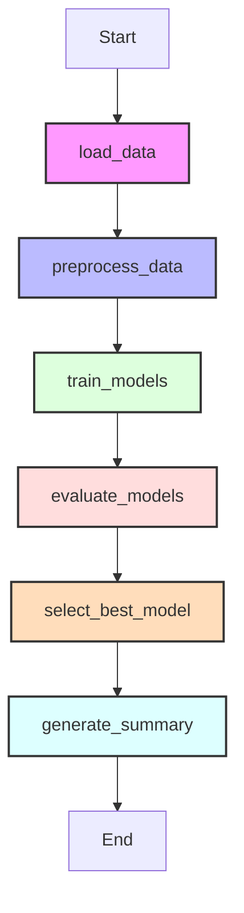

# 🧬 CancerML Agent: Agentic ML Assistant for Breast Cancer Classification

CancerML Agent is an interactive, modular, and beginner-friendly machine learning dashboard that classifies breast tumors as **malignant** or **benign** using the Breast Cancer Wisconsin dataset. The application orchestrates its pipeline execution using **LangGraph** workflow nodes and generates clinical-explainability metrics and run reports.

---

## 📌 Project Objective
The goal of this project is to build an educational yet professional machine learning assistant that:
1. Orchestrates traditional machine learning workflows using an agentic state-graph.
2. Trains and compares three classification models side-by-side: Logistic Regression, Support Vector Machine (SVM), and Random Forest.
3. Automatically identifies the best model using F1-score optimization.
4. Explains machine learning performance metrics and confusion matrix cells in standard, non-technical terms.
5. Auto-generates downloadable Markdown summaries of pipeline execution statistics.

---

## 🚀 Features
* **LangGraph Orchestration:** Every step of the pipeline executes as an independent, state-passing node.
* **Model Selection:** Automatically fits Logistic Regression, Support Vector Machine, and Random Forest Classifier on scaled data, then selects the top-performing model.
* **Explainability Agent:** Breaks down metrics (Accuracy, Precision, Recall, F1) and details what each cell of the confusion matrix represents.
* **Report Generation:** Automatically compiles dataset facts, model comparison metrics, confusion matrices, and explainability summaries into a printable Markdown report.
* **Streamlit UI:** Provides interactive visualizations, metrics comparisons, confusion matrix plots, and a direct download button for the generated report.

---

## 🛠️ Tech Stack
* **Language:** Python 3.9+
* **ML Library:** `scikit-learn`
* **Data Manipulation:** `pandas`, `numpy`
* **Workflow Orchestration:** `langgraph`
* **Visualization:** `matplotlib`
* **Interface & App:** `streamlit`
* **Markdown Tables:** `tabulate`

---

## 🔄 Workflow Diagram



---

## 📂 Project Structure
```
CancerML-Agent/
├── app.py                  # Streamlit application dashboard
├── requirements.txt        # Python library dependencies
├── README.md               # Project documentation
├── .gitignore              # Files ignored by version control
├── src/
│   ├── __init__.py         # Python package marker
│   ├── data_loader.py      # Loads dataset from scikit-learn
│   ├── preprocessing.py    # Stratified split and StandardScaler
│   ├── model_training.py   # Fits LR, SVM, and Random Forest
│   ├── evaluation.py       # Metrics extraction
│   ├── graph.py            # LangGraph workflow nodes and StateGraph
│   ├── explanation_agent.py# Rule-based explainability agent
│   └── report_generator.py # Formats markdown run reports
├── reports/                # Folder containing CSVs and Markdown run logs
└── notebooks/              # Reserved for future Jupyter Notebook explorations
```

---

## 📥 How to Install

1. **Clone the repository:**
   ```bash
   git clone https://github.com/sonayadav26/CancerML-Agent.git
   cd CancerML-Agent
   ```

2. **Create and activate a virtual environment:**
   * **Windows:**
     ```bash
     python -m venv venv
     venv\Scripts\activate
     ```
   * **macOS / Linux:**
     ```bash
     python -m venv venv
     source venv/bin/activate
     ```

3. **Install dependencies:**
   ```bash
   pip install -r requirements.txt
   ```

---

## 🚀 How to Run
Run the Streamlit application from your terminal:
```bash
streamlit run app.py
```
This will start a local server (typically at `http://localhost:8501`). Open this URL in your web browser, and click the **"Run ML Pipeline (LangGraph Workflow)"** button to view execution steps, charts, and download generated reports.

---

## 🗺️ Future Improvements
* **LLM Integration:** Connect to Gemini or OpenAI APIs to enable free-form Q&A regarding dataset features and models.
* **Hyperparameter Tuning:** Add visual sliders to Streamlit to dynamically tune model params (e.g., number of trees in Random Forest, SVM kernels) inside the LangGraph state.
* **Feature Importance:** Visualize which diagnostic feature columns (e.g., mean radius, perimeter) have the largest influence on predictions.

---

## 📄 Safety Disclaimer
> [!IMPORTANT]
> **This project is for educational and research purposes only and is not intended for medical diagnosis.** The predictions and explanations generated by this application should never be used to make real-world healthcare decisions. Always consult a qualified medical professional for health advice.

---

